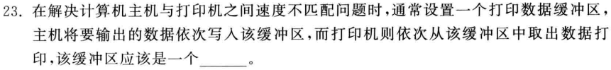

# 答案

## 2018

一、

1-5 ABCBD 6-10 ACBDA

二、

1. 链式存储结构 \(1\) 当多个线性表同时存在，采用链式存储结构比顺序存储结构节省空间 \(2\) 当长度动态变化，采用链式存储结构比顺序存储结构效率更高 
2. 第7层有10个叶结点的完全二叉树有两种情况： \(1\) h=7，此时结点数最少：$$2^6-1+10=73个$$	 \(2\) h=8，此时结点数最多：$$2^7-1+第8层叶结点数 = 235个$$ 第8层叶结点数 = \(第7层总结点数 - 第7层叶结点数\)\*2$$= (2^{7-1} - 10)*2 = 108$$ 
3. \(1\) 邻接矩阵中，不为0的元素的个数的一半，即为边的数组 \(2\) 邻接矩阵中，顶点对应的行中，不为0的元素的个数，即为顶点的度 \(3\) 邻接矩阵中，顶点i对应的行与顶点j对应的列相交处的元素值为1则存在边，否则不存在 
4. 因为折半插入排序中的查找过程可由“判定树”来描述，其比较次数由元素所在“判定树”的层数决定，与待排序序列的初始状态无关。 当待排序序列已经有序（升序）时，折半插入排序比直接插入排序需要进行更多元素之间比较

三、

1. 交换p指向的结点和其直接后继结点的位置 
2. 进展顺序：a1，a2，a3，a4，a5，a6 出栈顺序：a2，a3，a4，a6，a5，a1  左侧栈底 \| a1 \| a2 \|      \|    a1，a2进 \| a1 \| a3 \|      \|    a2出，a3进 \| a1 \| a4 \|      \|    a3出，a4进 \| a1 \| a5 \| a6 \|   a4出，a5，a6进 \|      \|       \|      \|    a6，a5，a1出 结论：堆栈的容量至少应该是3个元素的空间 
3.    
4.   深度优先遍历：ACBDE 广度优先遍历：ACEBD

四、

## 2017

一、

1-5 DBABA 6-10 CCDDB

二、

1. 顺序
2. 链式
3. 2   
4.  设该满K叉树深度为h，则前h-1层结点总数即为分支结点数n，即  $$n=k^0+k^1+k^2+...+k^{h-2}=\frac{k^{h-1}-1}{k-1}$$  且 $$叶结点数=k^{h-1}=n(k-1)+1$$ 
5. 中序序列
6. $$2(n-1)$$ 
7. 队列
8. 哈希（散列）查找法
9. 15次
10. 插入排序： $$O(n)$$  快速排序： $$O(n^2)$$  二路归并排序：

三、

1. 先把可能的五中结构确定，然后依次按照中序abc补充完整二叉树即可   
2.       
3. 因为在不同的情况下，同一个查找算法的效率会有所不同，我们需要根据实际情况选择适当的查找算法。 （1）当查找表的长度n较小且无序时，选取顺序查找法比哈希（散列）查找法效率要高，而此时折半查找不能用，因为折半查找的前提需要查找表顺序存储且有序。 （2）当查找表的长度n较小且为顺序存储并有序时，选取折半查找法效率较高。 （3）当查找表的长度n非常大，应选取哈希（散列）查找法，虽然哈希（散列）表增加了额外的存储空间，但在n非常大的情况下可以忽略不计，并且能大大提升查找效率 
4.     

四、  

## 2016

一、

1-5 BCABD 6-10 BCD\_D

二、

1. 链式存储结构，因为插入删除操作，在顺序存储结构的线性表中需要移动多个元素效率较低，而链式存储结构的线性表只需要改变指针的指向即可 
2. 不正确    
3. 深度优先搜索，对有向图进行深度优先搜索时，如果出现某一个结点被第二次访问，则说明该有向图中存在环路 
4. 大顶堆积二叉树，任何一颗子树的左右子树的根节点的值都小于或等于该子树的根节点的值； 二叉排序树，任何一颗子树的左子树中全部结点的值都小于根节点的值，右子树中全部结点的值都大于根节点的值。 
5. 冒泡排序只需进行1趟排序，n-1次比较即可完成排序，时间复杂度为 $$O(n)$$  快速排序，当初始表中元素已经有序是，快速排序效较低，时间复杂度为 $$O(n^2)$$ 

三、

1. p-&gt;rlink = q-&gt;rlink; q-&gt;rlink-&gt;llink = p; 
2. $$n=n_0+n_m$$   $$n_m=\frac{m^{h-1}-1}{m-1}=>m^h=m[(m-1)n_m+1]$$   $$n=\frac{m^h-1}{m-1}=\frac{m[(m-1)n_m+1]-1}{m-1}$$  则有 $$n_0+n_m=\frac{m[(m-1)n_m+1]-1}{m-1} =>n_0=(m-1)n_m+1$$  
3. 当顶点数为1时，边数为0 当顶点数为2时，边数为1 设顶点数为n-1时，边数为n-2  当定点数为n时，则有n-1+1 = n-2+1，n=n-1 
4.    
5.    

四、

## 2015

一、

1-5 BAADC 6-10 BADCC

二、

1. 链式
2. 栈和队列
3. top-&gt;link = p; top = p;
4. 16
5. d, b, e, f, c, a
6. 10
7. 深度优先搜索
8. 65，15，30，37
9. 小于或等于散列表长度的最大素数
10. 快速排序

三、

1. $$log_2{\frac{n}{2}}$$ 
2.     
3. 若无向图G中每个顶点的度至少为2，则对该图进行深度优先搜索的时候，必定会重复访问某个结点，也就是图中必定存在回路 
4. 顺序表，且有序。因为折半查找过程，需反复计算低位low和高位high的中间位置，而在链表中该计算过程比较困难，因此不能在链表中采用折半查找法

四、

## 2014

一、

1. rear -&gt; link -&gt; link = rear -&gt; link -&gt; link -&gt; link
2. 两个堆栈的栈顶位置相遇时
3. 71
4. 前序遍历
5. 连通图
6. f, c, b
7. 8. $$\frac{n(n+1)}{2}$$ 
9. 插入排序法
10. a, d, s, b, f, l, t, w

二、

1. 输入性、输出性、有穷性、有效性、确定性 
2. 4中操作在顺序表和链表上的时间复杂度分别为： （1）$$O(1)$$和$$O(n)$$ （2）$$O(1)$$和$$O(1)$$ （3）$$O(n)$$和$$O(n)$$ （4）$$O(n)$$和$$O(n)$$ 因此（1）操作，在顺序表上实现比在链表上实现效率更高一些 
3. 由题设可得该二叉树每一层节点数为1，除根节点外每个节点可选位置数为2，故该二叉树共有 $$2^n-1$$ 种 
4. 因为当散列表中多个连续位置被占用以后，再散列到这些位置的的元素与直接散列到后面一个空闲位置的元素都要占用这一空闲位置，致使空闲位置肯容易被占用，造成更大的聚聚。采用二次探测再散列的方法可以减少这种聚集。

三、

1. 最后一个出栈元素为1的情况：321、231 最后一个出栈元素为2的情况：132 最后一个出栈元素为3的情况：123、213 
2.     
3. 当无向图越稠密，即无向图其余顶点的度都为2时，无向图顶点数最少。设其余顶点数为x，则有： $$2*16=4*3+3*4+2x$$ 解之得x = 4，则无向图至少有3+4+4=11个。 
4. 
四、

## 2013

一、

1-5 CCDB\_ 6-10 BDA\_D

二、

1. 顺序
2. $$O(m)$$
3. 2k-1或2k
4. 235或234个
5. 2\(n-1\)
6. 有向图中没有环路
7. $$\frac{11}{10}log_211-1$$ 
8. \_
9. 插入排序法
10. 9次

三、

1. 2. T-&gt;lchild == NULL && T-&gt;rchild == NULL T-&gt;lchild T-&gt;rchild 
3.    h\(k\) = k MOD p，取p=7 $$\alpha\approx0.61$$ 

四、

## 2012

一、

1. 数据的逻辑结构、存储结构以及在其上的操作
2. 链式存储结构
3. $$O(1)$$ 
4. 8
5. BFGDECA
6. \_
7. 子图
8. 65，15，30，37
9. $$\frac{n(n+1)}{2}$$ 
10. 1, 5, 11, 15, 19, 77,  59, 48, 26, 61

二、

1. 100个顶点的邻接矩阵，总元素数：100x100=10000个 200条边，非零元素个数：400个  $$\frac{400}{10000}=4\% < 5\%$$ ，故该邻接矩阵为稀疏矩阵 
2. 开放定址法是指将散列表中“空”地址向处理冲突开放，当散列表未满时，处理冲突需要的“下一个”空缺位置，在散列表中解决。 
3. 冒泡排序法 如果是选择排序法，第二趟排序结果为：2，5，16，18，12，10 
4. 最大：n；最小： $$log_2n$$ 

三、

1. 第4条语句错误，应该为：q-&gt;rlink-rlink-llink = p; 
2. 题设完全二叉树，当其深度h=8时，结点总数取得最大值 第7层结点数： $$2^{7-1}=64$$ ，非叶结点数：64-10=54个 第8层叶结点数：54x2=108个 总结点数：前7层结点数 + 第8层叶结点数 = $$2^7-1+108=235个$$  
3. 当顶点数为：1，最多边数为：0 当顶点数为：2，最多边数为：1 当顶点数为：3，最多边数为：3 设当顶点数为：n-1，最多边数为： $$\frac{(n-1)(n-2)}{2}$$  则当顶点数为：n+1-1，最多边数为：$$\frac{(n+1-1)(n+1-2)}{2}$$，即 当顶点数为：n，最多边数为：$$\frac{n(n-1)}{2}$$ 
4.     

四、

## 2011

一、

1-5 DCABB 6-10 DCAAC

二、

1. 插入： $$\frac{n}{2}$$  删除： $$\frac{n+1}{2}$$ 表的长度、插入或删除位置 
2. 只设置一个队尾指针，时间效率要高。 只设置一个队尾指针，队尾指针的“下一个”结点即为队头指针，入队和出队的时间复杂度为 $$O(1)$$  只设置一个队头指针，要想找到队尾指针需要遍历整个队列，入队和出队的时间复杂度为$$O(n)$$ 
3. 稀疏图采用邻接表存储，稠密图采用邻接矩阵存储 邻接表存储，是用一个1维数组存储顶点信息，一个2维数组存储边信息 邻接矩阵存储，是用一个2维数组存储所有顶点之间的是边信息，有边有1，无边为0 若稀疏图采用邻接矩阵存储，会造成较大空间的浪费 若稠密图采用邻接表存储，其在空间上除了存储边信息外，还需存储顶点信息，空间开销会更大 
4. 小顶堆积：二叉树本身或任何一个子树其根结点元素值，都小于或等于其左右子结点元素的值，例如序列10，20，30，40，50，60、70的小顶堆积如下：    最大元素可能处于任何一个叶结点中

三、

1. k=j+1; k&lt;n; k++ j++; i++; 
2. \_ 
3. \_ 
4.    

四、

## 2010

一、

1-5 CAADB 6-10 DACDA

二、

1. $$p_i*\sum_{i=1}^{n+1}i=\frac{2(n-i+1)}{n(n+1)}*\frac{n(n+1)}{2}=\frac{2(n-i+1)}{2}$$  
2. 方法中通过直接或间接调用自己的过程，称为递归调用。用该方法描述的算法，即为递归算法。递归算法需要借用栈的结构来完成。 
3. 遍历起始位置、遍历方法是深度优先搜索还是广度优先搜索、图的存储结构 
4. 堆积排序 题设条件下，设n=10000，m=10，则 选择排序的时间复杂度为： $$O(mn)$$  快速排序的时间复杂度为：$$O(nlog_2n)$$ 堆积排序的时间复杂度为：$$O()$$

三、

1.    拓扑排序： ABCFED ABFCED 
2.     
3.     
4. 查找整形数组中的最大值

四、

## 2008

一、

1. 顺序存储结构：内存中存储数据的地址必须连续，可用存储结构表示其逻辑结构，通常用数组这一结构表示 链式存储结构：内存中存储数据的地址不一定连续，没个存储结点除了存储数据外，还需要用一个指针标识其下一个结点，来标示其逻辑结构。 
2. CDEBA、CDBEA、CDBAE 
3. 需比较关键字：20、12、21、34    
4. 
二、

1. p-&gt;llink-&gt;rlink=p 
2. $$n=n_0+n_2$$  $$n=1+2n_2$$  $$n_2=n_0-1$$  $$分支数=2*n_2=2(n_0-1)$$  
3.     拓扑排序： v1, v2, v3, v4, v5 v1, v3, v4, v2, v5 v1, v3, v2, v4, v5 
4. \_

三、

四、

## 2007

一、

1-5 DCBAD 6-10 B\_C\_C 

二、

1. 顺序存储结构，因为顺序存储结构的线性表存储元素的时间复杂度为 $$O(1)$$  
2. \_ 
3. 选择插入排序 插入排序：13次 冒泡排序：17次

三、

1. 计算单链表中的的结点总数 
2. abc全排列：abc、acb、bac、bca、cab、cba 可能出栈序列： abc：PUSH, POP, PUSH,POP, PUSH, POP acb：PUSH, POP, PUSH, PUSH, POP, POP  bac：PUSH, PUSH, POP, POP, PUSH, POP bca：PUSH, PUSH, POP, PUSH, POP, POP cba：PUSH, PUSH, PUSH, POP, POP, POP 不可能出栈序列： cab 
3.     \_构造最小生成树\_

四、

## 2006

一、

1. $$O(1)$$ 
2. 链式
3. b, c, e, d, a
4. $$\frac{n+1}{2}$$ 
5. 6. 113
7. 5
8. 3
9. $$\frac{n(n-1)}{2}$$ 
10. 59, 45, 26, 15, 19, 11, 1, 5, 61, 77

二、

1. 不是， 
2. 
三、

四、

## 2005

一、

1-5 CDDAC 6-10 BBDBC

二、

1. 顺序存储结构、链式存储结构、索引存储结构、哈希（散列）存储结构
2. $$O(1)$$ 
3. 1+LENGTH\(list-&gt;link\)
4. p = lista; p-&gt;link != NULL; p = p-&gt;link
5. top--
6. 索引二叉树
7. 求矩阵第i列中不为0的元素的个数
8. 5, 8, 6, 7
9. 选择排序
10. 77, 61, 59, 15, 5, 14, 26, 1

三、

 

四、

